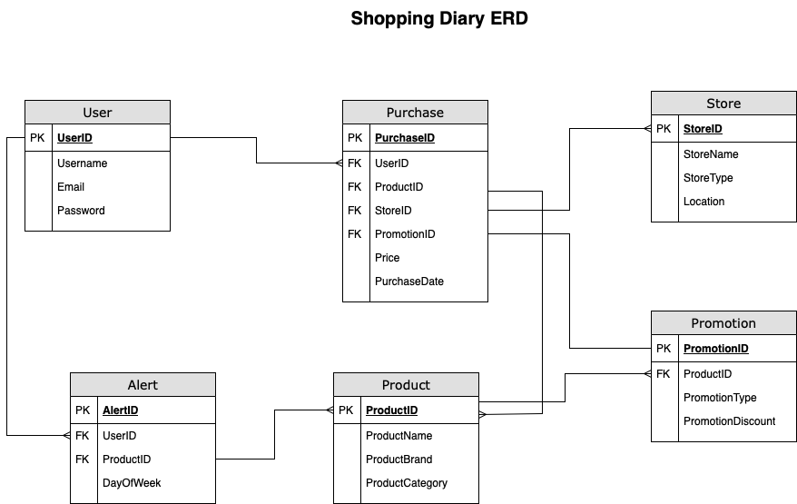

# IshanAcharya_T2A2 - Shopping Diary API Webserver Application

## Introduction

Github Repository - https://github.com/IshanAcharya/T2A2_APIWebServer

Trello Board - https://trello.com/b/ftQCFYV2/t2a2-api-webserver-shopping-diary

## R1. Identification of the problem you are trying to solve by building this particular app.

In the current Australian economic climate, where the cost of living is currently at an all time high, it has become more prominent than ever for people to start budgeting and reviewing their expenses to implement cost saving measures to maintain their way of life, or to just 'survive'. For simple budgeting, there are a huge variety of budgeting applications or even a simple spreadsheet that can allow people to manage their finances. However, when it comes to shopping and analysing one's own personal shopping habits, there lays a few pain points there that prohibit people from conducting reviews into their shopping patterns and habits which limit their ability to improve their shopping behaviours and thus improve their finances.

Some of these pain points include:

* **Difficulty in manual purchase tracking** - Shoppers struggle in manually keeping track of their shopping purchases due to time constraints and laziness which leads to difficulties in manging their budgets. Without a centralised system for recording their purchase details, shoppers find it difficult to maintain an organised record of their shopping history to make informed decisions when buying products

* **Difficulty in analysing purchase patterns** - Understanding a shopper's own purchasing behaviour is crucial in them making an informed decisions about their future purchases, which then impacts their budgeting. Manually analysing one's purchase patterns from physical and digital receipts that are scattered across different locations and retailers can be very time cosuming and inefficient. Without a dedicated platform to analyse purchase data, shoppers cannot gain valuable insights into their spending habits or identify opportunities where there can save money

* **Missing out on promotion tracking** - Shoppers often miss out on promotions or sales due to a lack of awareness or oversight. There are online websites that provide a platform for shoppers to share countless deals and sales, however this can include products of every size, type and usage, which is not useful for a shopper that knows what their specific needs and interests are in products that they need. Without a systematic way to track promotions across various products and stores that are relevant to the shopper, shoppers will overlook discounts and end up spending more

* **Existing applications that are specific to retailers** - Different retailers have their own applications which allow shoppers to conduct online purchases and view their past orders, purchases and even view their online receipts. However due to the saturated market in the grocery and retail sectors, it becomes too difficult for shoppers to attempt in analysing their shopping behaviour and purchasing patterns due to them needing to review this across the countless number of different applications they would need from each retailer to review their respective purchases from their respective applications.

This Shopping Diary API application aims to address all of the aforementioned pain points by providing shoppers with a comprehensive platform for tracking purchases, analysing spending patterns, and allowing them to set alerts for promotions or sales. By providing these robust features to engage in their own purchase management and purchase analysis, this application seeks to empower users to make informed shopping decisions to optimise their spending habits effectively, and in turn help them save money towards their budgets and finances.


## R2. Why is it a problem that needs solving?

The pain points identified above in R1, which include the problems of difficulty in manual purchase tracking, analysing purchase patterns,  missing out on promotions, and difficulty in managing various retailer-specific apps, all have significant ramifications for individuals and households trying to manage their finances effectively. In detail, they have additional impacts such as:

* **Financial impact** - In today's economic climate, where the cost of living is so high, for families and inividuals every dollar saved counts. Difficulty in manually tracking purchases and analysing spending patterns can lead to overspending, budgetary constraints, and eventually, financial stress. Without insights into their spending habits, individuals may sstruggle to identify areas where they can cut costs and save money, which ultimately hinder their financial stability and their wellbeing.

The Shopping Diary API will offer individuals the ability to track their purchases and analyse their spending habits, which will empower them to understand their spending habits and identify areas for cost-saving measures. By providing individuals with visibility into their finances, they can make informed decisions to optimise their spending and improve their financial stability

* **Time and effort** - Manual tracking of purchases and analysing both physical and online receipts from various sources is extremely time consuming and highly inefficient. In a fast-paced digital society where every second counts, individuals need steamlined solutions to manage their finances effectively and on a timely manner. By providing these functionalities through a centralised platform, such as through the Shopping Diary API, it allows for individuals to conduct their purchase tracking and analysis in the one location and allows them to save valuable time to focus on other aspects of their lives

* **Opportunity cost** - For shoppers, missing out on promotions and discounts due to a lack of awareness or oversight represents a huge missed opportunity for savings. In an economic climate where every dollar, and down to the last cent, matters, individuals need tools and solutions that enable them to stay informed about when promotions for products they usually buy go on sale, which helps them make informed purchasing decisions. The Shopping Diary API, through promotion tracking functionalities and alerts, allows them to do this by allowing them to track promotions across various products and stores and set alerts themselves, which allow for individuals to capitalise on saving opportunities and make their money go that one step further

* **Accessibility and convenience** - Existing applications that are specific to retailers creates a fragmentation in the retail app market, which causes inconvenience for users who need to navigate across multiple platforms to analyse their shopping behaviour. The Shopping Diary API addresses this challenge by providing users with a single platform to track their purchases, analye their spending patterns and set alerts for when products they usually purchase go on sale. By doing this, it creates a single point of reference for users and helps them avoid the fragmentation and inconvenience associated with multiple platforms. This enables them to effectively monitor their spending habits and achieve their financial goals. 

By integrating purchase tracking and offering the ability to analyse their spending habits through a single platform, the Shopping Diary API empowers users to understand their spending habits, maximise saving opportunities and streamline their shopping experiences. Through these solutions, the Shopping Diary API offers a transformative step towards allowing individuals and households to gain financial empowerment and wellbeing in today's dynamic economic landscape by offering them a comprehensive solution to the intricate challenges that they face, as outlined above.

## R3. Why have you chosen this database system. What are the drawbacks compared to others?

Chosen for:

- open source
- robustness
- reliability
- support for complex relationships


Drawbacks: 

- Complexity vs other database systems
- Learning curve


## R4. Identify and discuss the key functionalities and benefits of an ORM.

Object Relational Mapping, often known and abbreviated as ORM, is a programming technique used to interact between a program and a database, usually a relational database (FreeCodeCamp, 2024). An ORM tool is a piece of software designed to help object opriented programs to ineract with relational databases (FreeCodeCamp, 2024).

An example of an ORM tool that exists in Python is SQLAlchemy, which was also utilised for the development of this Shopping Diary API. SQLAlchemy is an open-source SQL toolkit and an ORM (Wikipedia, 2024) which simplifies database interactions by allowing developers to abstract database logic into object oriented code. In the case of thi application, between the application and its relational database, postgreSQL.


**Key functionalities**

The key functionalities of ORM tools, such as SQLAlchemy, include:

* Generating and managing schemas
* Data manipulation (CRUD)
* Mapping objects to tables
* Relationship management
* Faster queries


**Benefits**

Benefits of using ORM tools, such as SQLAlchemy, include:


* Portability

* Maintainability


- On Ed lesson for ORM Pros and Cons


## R5. Document all endpoints for your API.

Auth Endpoints

Register
    POST - /auth/register

Login 
    POST - /auth/login

Authenticate
    GET/POST - /auth/protected


User Endpoints

Create User
    POST - 
Get User
    GET - 
Update User
    PUT - 
Delete User
    DELETE - 


Product Endpoints

Create Product
    POST - 
Get Product
    GET - 
Update Product
    PUT - 
Delete Product
    DELETE -


Purchase Endpoints

Create Purchase
    POST - 
Get Purchase
    GET - 
Update Purchase
    PUT - 
Delete Purchase
    DELETE -


Promotion Endpoints

Create Promotion
    POST - 
Get Promotion
    GET - 
Update Promotion
    PUT - 
Delete Promotion
    DELETE -

Store Endpoints

Create Store
    POST - 
Get Store
    GET - 
Update Store
    PUT - 
Delete Store
    DELETE -

Alert Endpoints

Create Alert
    POST - 
Get Alert
    GET - 
Update Alert
    PUT - 
Delete Alert
    DELETE -

## R6. An ERD for your app.



## R7. Detail any third party services that your app will use.

The Shopping Diary application utilises multiple third party services to deliver it's core functions. These include:

| Third Party Service | Details of service |
| ------------------- | ------------------ |
| bcrypt              | Hashing library for secure password storage |
| dotenv              | Library for loading environment variables from application's .env file |
| Flask               | Python micro web framework for building applications |
| Flask JWT Extended  | Extension for Flask to work with JSON Web Tokens (JWT) to provide authentication and authorisation |
| Marshmallow         | Flask extension library that allows serialization and deserialization of data |
| PostgreSQL          | Power open-source relational database system that stores the application's data |
| psycopg2            | PostgreSQL adapter that allows the application to interact with PostgreSQL database |
| SQLAlchemy          | Object-Relational Mapping (ORM) toolkit which allows for the program to interact with PostgreSQL through Python objects |


## R8. Describe your project models in terms of the relationships they have with each other

For a database-driven application such as this Shopping Diary API Application, it's important to establish relationships between the different models within the project in order to organise and manage the data within it effectively. Models for this Shopping Diary API application are separated into 6 different models: `user`, `product`, `promotion`, `purchase`, `store`, and `alert`. 

For this application, relationship between the 6 models were established using SQLAlchemy, which is a powerful Object-Relational Mapper (ORM) for Python (Wikipedia, 2024). SQLAlchemy was utilised as it provided a declarative way of defining the relationships between the models, which simplified database interactions.

Parent-Child relationships are established using SQLAlchemy through the use of foreign keys and relationship attributes. To estbalish relationships between models in SQLAlchemy, the `db.relationship` method was utilised. This method allowed for attributes to be created on the parent model, which allowed access to related objects as well as attributes on the child model to access the parent object.

In this application, all the models have the following parent-child relatiosnhips established:

* **User as parent** - Users are set as the parent entities, as they can initiate interactions within the system by making purchases and setting alerts

* **Purchase, Alert as children** - Purchases and alerts are child entities associated with users. Each purchase or alert is linked to a specific user, which establishes a parent-child relationship

* **Product, Store, Promotion as independent entities** - Products, stores, and promotions can be considered as independent entities which are not directly linked to users. They can, however, still have relationships with purchases, alerts, or with each other.

For example, 

`user`

```class User(db.Model):
# Define table name for the model
    __tablename__ = 'users'

    # Define columns for the model
    id = db.Column(db.Integer, primary_key=True)
    username = db.Column(db.String(50), unique=True, nullable=False)
    email = db.Column(db.String(120), unique=True, nullable=False)
    password = db.Column(db.String(60), unique=True, nullable=False)


# Define relationships with other models
    purchases = db.relationship('Purchase', backref='buyer', lazy=True)
    alerts = db.relationship('Alert', backref='owner', lazy=True)
```

In the `user` model above, the relationship with the `purchase` and `alert` models are established through the `db.relationship` attribute. This attribute specifies the relatiosnhip between the `user` model(parent) and the `purchase` and `alert` models (children). The `backref` parameter in `db.relationship` defines a reference from the child models, `purchase` and `alert`, back to the parent model `user`, which enables easy navigation between related objects. Through this parent-child relationship, a `user` object can easily access all purchases made by that user through the `purchases` attribute. In the application, the `db.relationshp` method is used different on different models based on the cardonality and directionality of the relationships.

In another example, 

`purchase`

```class Purchase(db.Model):
    # Define table name for the model
    __tablename__ = 'purchases'

    # Define columns for the model
    id = db.Column(db.Integer, primary_key=True)
    user_id = db.Column(db.Integer, db.ForeignKey('users.id'), nullable=False)
    product_id = db.Column(db.Integer, db.ForeignKey('products.id'), nullable=False)
    store_id = db.Column(db.Integer, db.ForeignKey('stores.id'), nullable=False)
    promotion_id = db.Column(db.Integer, db.ForeignKey('promotions.id'))
    price = db.Column(db.Float, nullable=False)
    purchase_date = db.Column(db.DateTime, nullable=False)

    # Define relationship with other models
    users = db.relationship('User', backref='purchases')
    products = db.relationship('Product', backref='purchases')
    stores = db.relationship('Store', backref='purchases')
    promotions = db.relationship('Promotion', backref='purchases')
```

In the above `purchase` model, the relationships with `user`, `product`, `store` and `promotion` models are established using the same `db.relationship` method and the `backref` parameter.

By establishing the relationships, it allowed for:

* **Data consistency** - Relationships between the models ensured that the data remained consistent across the 6 different models. E.g. In the application, associating purchases with users ensured that each purchase was attributed to a specific user

* **Data integrity** - Relationships between the models enforced constraints and rules that maintained the integrity of the data within the application. E.g. By ensuring that each purchase is associated with an existing product, it helps prevent orphaned records

* **Efficent data access** - Relationships between the models enable efficient querying and retrieval of related data. Instead of having to manually link records, establishing the relationships allow easy navigation between associated objects. 

Using SQLAchemy to establish relationships between models in this application ensured data consistency, integrity, and efficient data access. By understanding and defining these relationships between the 6 models, it created a robust application to handle complex data interactions efficiently and effectively. 

## R9. Discuss the database relations to be implemented in your application.

During the planning stage of this Shopping Diary API Application, it was essential to first create an Entity Relationship Database that would allow me to visualise how I wanted the relationships to work with the 6 different models within this application. By doing this, it allowed me to establish how users, products, promotions, purchases, stores and alerts would interact with each other. 

**User Model**

`user`

```class User(db.Model):
    # Define table name for the model
    __tablename__ = 'users'

    # Define columns for the model
    id = db.Column(db.Integer, primary_key=True)
    username = db.Column(db.String(50), unique=True, nullable=False)
    email = db.Column(db.String(120), unique=True, nullable=False)
    password = db.Column(db.String(60), unique=True, nullable=False)


    # Define relationships with other models
    purchases = db.relationship('Purchase', backref='buyer', lazy=True)
    alerts = db.relationship('Alert', backref='owner', lazy=True)
```

The `user` model represents individuals who use the application and is central to the entire application system. Users can make purchases and set alerts for products.

Relationships:

    * One-to-Many relationship with `purchase`: Each user can make multiple purchases, established through the `purchases` relationship
        * Cardinality: One-to-Many (one user can have multiple purchases)
        * Directionality: User (One) -> Purchase (Many)

    * One-to-Many relationship with `alert`: Each user can set up multiple alerts, established through the `alerts` relationship
        * Cardinality: One-to-Many (one user can set up multiple alerts)
        * Directionality: User (One) -> Alert (Many).

**Product Model**

`product`

```class Product(db.Model):
    # Define table name for the model
    __tablename__ = 'products'

    # Define columns for the model
    id = db.Column(db.Integer, primary_key=True)
    name = db.Column(db.String(100), nullable=False)
    brand = db.Column(db.String(100))
    category = db.Column(db.String(100))

    # Define relationships with other models
    purchases = db.relationship('Purchase', backref='product', lazy=True)
    alerts = db.relationship('Alert', backref='product', lazy=True)
    promotions = db.relationship('Promotion', backref='product', lazy=True)
```

The `product` model represents items available for purchase in the application. Products can be purchased by users, trigger alerts, and be associated with promotions.

Relationships:

    * One-to-Many relationship with Purchase: Each product can be associated with multiple purchases, established through the `purchases` relationship
        * Cardinality: One-to-Many (One product can be associated with multiple purchases)
        * Directionality: Product (One) -> Purchase (Many)

    * One-to-Many relationship with Alert: Each product can be associated with multiple alerts, established through the `alerts` relationship
        * Cardinality: One-to-Many (One product can be associated with multiple alerts)
        * Directionality: Product (One) -> Alert (Many)

    * One-to-Many relationship with Promotion: Each product can be associated with multiple promotions, established through the `promotions` relationship
        * Cardinality: One-to-Many (One product can be associated with multiple promotions)
        * Directionality: Product (One) -> Promotion (Many).

**Promotion Model**

`promotion`

```class Promotion(db.Model):
    # Define table name for the model
    __tablename__ = 'promotions'

    # Define columns for the model
    id = db.Column(db.Integer, primary_key=True)
    purchase_id = db.Column(db.Integer, db.ForeignKey('purchases.id'))
    promotion_type = db.Column(db.String(50), nullable=False)
    promotion_discount = db.Column(db.Float, nullable=False)

    # Define relationship with other models
    purchases = db.relationship('Purchase', backref='promotions')
```

The `promotion` model represents discounts or special offers applicable to products. Promotions can be associated with purchases made by users.

Relationships:

    * One-to-One relationship with `purchase`: One promotion can be associated with one purchase, established through the `purchases` relationship
        * Cardinality: One-to-One (One promotion can be associated with one purchase)
        * Directionality: Promotion (One) -> Purchase (One)

    * Many-to-One relationship with `product`: Many products can be applied to one promotion, established through the `product` relationship
        * Cardinality: Many-to-One (Many products can be applied to one promotion)
        * Directionality: Product (Many) -> Promotion (One).

**Purchase Model**

`purchase`

```class Purchase(db.Model):
    # Define table name for the model
    __tablename__ = 'purchases'

    # Define columns for the model
    id = db.Column(db.Integer, primary_key=True)
    user_id = db.Column(db.Integer, db.ForeignKey('users.id'), nullable=False)
    product_id = db.Column(db.Integer, db.ForeignKey('products.id'), nullable=False)
    store_id = db.Column(db.Integer, db.ForeignKey('stores.id'), nullable=False)
    promotion_id = db.Column(db.Integer, db.ForeignKey('promotions.id'))
    price = db.Column(db.Float, nullable=False)
    purchase_date = db.Column(db.DateTime, nullable=False)

    # Define relationship with other models
    users = db.relationship('User', backref='purchases')
    products = db.relationship('Product', backref='purchases')
    stores = db.relationship('Store', backref='purchases')
    promotions = db.relationship('Promotion', backref='purchases')
```

The `purchase` model represents transactions made by users. It captures details such as the product purchased, the user who made the purchase, the store where the purchase occurred, and any associated promotions.

Relationships:

    * Many-to-One relationship with `user`: Many purchases can be made by one user, established through the `buyer` relationship
        * Cardinality: Many-to-One (Many purchases can be made by one user)
        * Directionality: User (Many) -> Purchase (One)
    * Many-to-One relationship with `product`: Many purchases can involve one product, established through the `product` relationship
        * Cardinality: Many-to-One (Many purchases can involve one product)
        * Directionality: Product (Many) -> Purchase (One)
    * Many-to-One relationship with `store`: Many purchases can be made at one store, established through the `stores` relationship
        * Cardinality: Many-to-One (Many purchases can be made at one store)
        * Directionality: Store (Many) -> Purchase (One)
    * One-to-One relationship with `promotion`: Each purchase can be associated with one promotion, established through the `promotions` relationship
        * Cardinality: One-to-One (Each purchase can be associated with one promotion)
        * Directionality: Promotion (One) - Purchase (One).

**Store Model**

`store`

```class Store(db.Model):
    # Define table name for the model
    __tablename__ = 'stores'

    # Define columns for the model
    id = db.Column(db.Integer, primary_key=True)
    name = db.Column(db.String(100), nullable=False)
    type = db.Column(db.String(50), nullable=False)
    location = db.Column(db.String(200), nullable=False)

    # Define relationship with other models
    purchase = db.relationship('Purchase', backref='stores', lazy=True)
```

The `store` model represents physical or virtual locations where products can be purchased, which provides context for purchases made by users.

Relationships:
    
    * One-to-Many relationship with `purchase`: Each store can have multiple purchases associated with it, established through the `purchases` relationship
        * Cardinality: One-to-Many (One store can have multiple purchases associated with it)
        * Directionality: Store (One) -> Purchase (Many).

**Alert Model**

`alert`

```class Alert(db.Model):
    # Define table name for the model
    __tablename__ = 'alerts'

    # Define columns for the model
    id = db.Column(db.Integer, primary_key=True)
    user_id = db.Column(db.Integer, db.ForeignKey('users.id'), nullable=False)
    product_id = db.Column(db.Integer, db.ForeignKey('products.id'), nullable=False)
    day_of_week = db.Column(db.String(20), nullable=False)

    # Define relationship with other models
    users = db.relationship('User', backref='alert', lazy=True)
    products = db.relationship('Product', backref='alert', lazy=True)
```

The `alert` model represents notifications set by users to monitor specific products. It allows users to input specific days as to when a product is likely to go on sale.

Relationships:

    * Many-to-One relationship with `user`: Many alerts can belong to one user, establihed through the `owner` relationship
        * Cardinality: Many-to-One (Many alerts can belong to one user)
        * Directionality: User (Many) -> Alert (One)
    * Many-to-One relationship with `product`: Many alerts can be set for one product, established through the `product` relationship
        * Cardinality: Many-to-One (Many alerts can be set for one product)
        * Directionality: Product (Many) -> Alert (One).

Each of the relationships established above have specific cardinality and directionality, which indicates how the entities within the database are related to each other and how they interact within the application. By doing this, it contributes towards ensuring data consistency and data integrity within the database of the application.

## R10. Describe the way tasks are allocated and tracked in your project.

Trello Board - https://trello.com/b/ftQCFYV2/t2a2-api-webserver-shopping-diary

### Software Development Plan

- Use of Trello
- Kanban style board (to-do, in progress, review, completed)
- Project separated into different activities (activity 1, activity 2, activity 3, activity 4)
- Project milestones and deadlines 

### Project Milestones & Deadlines

I separated the deliverables of my project to 5 different activities to help separate my tasks, and provide a clear timeline as to when I needed to complete each section of the project. I separated these activities based on their categories (and labelled as such) including 'project planning', 'project coding & reviewing', 'project documentation', and 'project submission'. 

These activities included:

- Insert screenshot of Activity 1
- Insert screenshot of Activity 2
- Insert screenshot of Activity 3
- Insert screenshot of Activity 4

- Labels used to separate into different tasks
    - Project planning
    - Project coding & reviewing
        - Controllers
        - Models and schemas
    - Project documentation
    - Project submission
- Each task for project broken down into cards and categorised accordingly using labels
- Each card had checklists of sub-tasks 
- Workflow established where I had milestones/due dates in one column, my current outstanding tasks, what I was working on, what needed to be reviewed after being completed, and once a card/task passed through all of that, it ended up in the completed pile


# Reference

https://en.wikipedia.org/wiki/Object–relational_mapping

https://en.wikipedia.org/wiki/SQLAlchemy

https://www.freecodecamp.org/news/what-is-an-orm-the-meaning-of-object-relational-mapping-database-tools/